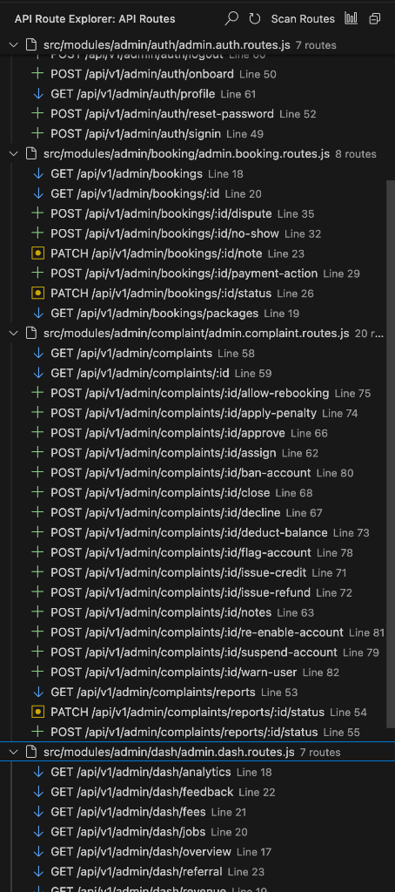
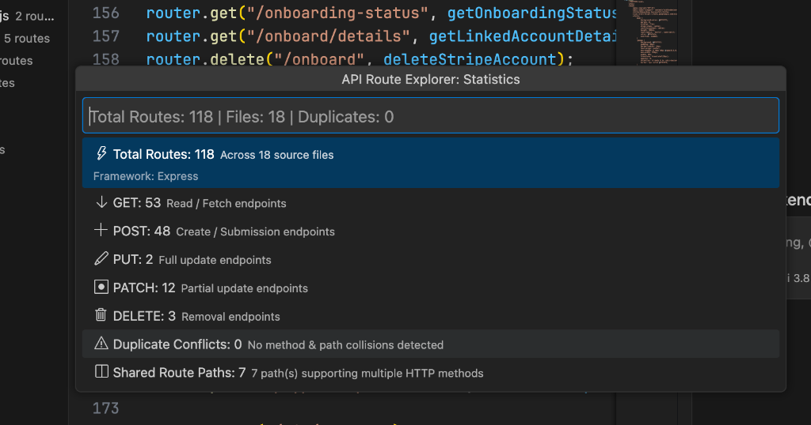

# API Routes Explorer

> **Discover → Analyze → Test → Response → Document API routes directly inside VS Code.**

[](https://github.com/hussnain-143/api-route-explorer/releases)
[](LICENSE)
[](https://marketplace.visualstudio.com/items?itemName=hussnain-143.api-route-explorer)
[](https://github.com/hussnain-143/api-route-explorer)
[](package.json)
[](https://github.com/hussnain-143)

**API Routes Explorer** is a developer-focused VS Code extension that automatically discovers, analyzes, tests, and documents backend API routes directly from your editor. Stop context switching between code, terminal windows, Postman, and Swagger docs.

---

## What It Does

```text
Open Project ──▶ Discover Routes ──▶ Analyze Health ──▶ Test in HTTP Client ──▶ Inspect Response ──▶ Export OpenAPI
```

1. **Discover**: Scans your workspace using offline AST parsing and organizes every API endpoint into an interactive Activity Bar tree.
2. **Analyze**: Evaluates route health, finds duplicate endpoints, highlights shadowed paths, and inspects middleware/guards.
3. **Test**: Opens a native, secure HTTP Client pre-populated with method, base URL, path parameters, and headers.
4. **Response**: Measures millisecond timing, status codes, payload sizes, and inspects formatted response bodies and headers.
5. **Document**: Generates deterministic OpenAPI 3.0.3 specifications with single-click YAML or JSON export.

---

## Screenshots

### 🌲 Discovered Routes in Activity Bar TreeView
*Explore all backend API endpoints categorized by file with HTTP method icons, route paths, and direct source line navigation:*

<p align="center">
  
</p>

### 📊 Real-time Route Statistics & Breakdown
*Instant route metrics showing breakdown across HTTP methods, duplicate collisions, and shared multi-method paths:*

<p align="center">
  
</p>

---

## Features

### 🧭 1. Route Discovery & Navigation
- **Offline AST Parsing**: Fast, non-executing static analysis of routes without running user code.
- **1-Click Jump to Code**: Click any route in the tree to jump directly to its controller definition line.
- **Smart Grouping**: Switch between **Group by File**, **Group by Framework**, **Group by HTTP Method**, or **Group by Health**.
- **Instant Search & Filter**: Real-time fuzzy filtering by route path, HTTP method, status, or handler name.
- **Sub-Second Scalability**: Discovers 4,700+ routes in under 100ms with debounced incremental file watchers.

### 🩺 2. Route Intelligence & Analysis
- **Health Ratings**: Automated categorization into `Healthy`, `Warning`, or `Error`.
- **Conflict & Shadowing Detection**: Flags parameterized routes that shadow static endpoints (e.g. `/users/:id` shadowing `/users/me`).
- **Duplicate Prevention**: Identifies duplicate HTTP method + normalized path collisions across different files.
- **Middleware & Guard Extraction**: Displays active middleware stacks, Fastify pre-handlers, and NestJS guards.
- **VS Code Diagnostics**: Integrated problems panel reporting for syntax and mounting errors.

### ⚡ 3. Native HTTP Client
- **Seamless Route Integration**: Click **Test API** on any discovered route to open the HTTP Client with all route context preserved.
- **Route Context Banner**: Displays the framework badge, route signature, and clickable source file link.
- **Dynamic Path Parameters**: Automatically detects `{id}` or `{slug}` and provides validated input fields.
- **Request Configuration**: Dedicated tabs for **Params**, **Headers**, **Body**, and **cURL**.
- **Formatted Response Inspector**: Color-coded status pills, millisecond duration, byte size, pretty-printed JSON, and header tables.
- **Request Cancellation**: Cancel in-flight requests safely with clean socket teardown.
- **Reproducible cURL**: Generates accurate, copyable cURL commands matching your active configuration.

### 📄 4. OpenAPI 3.0.3 Specification Generation
- **Automated Spec Builder**: Compiles an OpenAPI 3.0.3 specification from discovered routes without annotations.
- **Operation-Level Preview**: Click **View OpenAPI** to inspect a single route's YAML operation definition beside your code.
- **Deterministic Export**: Export full workspace specifications as standard JSON or YAML with zero machine path leaks.
- **Path Parameter & Body Mapping**: Automatically derives path parameter schemas and request body envelopes.

### 🎨 5. Developer UX & Theming
- **Native VS Code Integration**: Seamless styling under **VS Code Dark**, **VS Code Light**, and **VS Code High Contrast**.
- **Full Keyboard Accessibility**: Complete Tab navigation, Enter to activate, and Escape to dismiss.
- **Action Triad**: Clear, uncluttered route actions: `[ Analyze ] [ Test API ] [ OpenAPI ]`.
- **First-Run Experience**: Lightweight, non-intrusive welcome prompt requiring no setup.

### 🛡️ 6. Privacy & Security First
- **Zero Cloud Sync**: Everything runs 100% locally on your machine.
- **No Account Required**: No login, no sign-up, no API key needed.
- **No Telemetry**: No tracking, phone-home beacons, or external analytics.
- **No `.env` Scanning**: Local environment variables and secrets are never scanned or indexed.
- **Strict Content Security Policy**: Nonce-based script execution with `default-src 'none'`.

---

## Supported Frameworks

| Framework | Route Discovery | Router Prefixes | Middleware / Guards | HTTP Client | OpenAPI 3.0 |
| :--- | :---: | :---: | :---: | :---: | :---: |
| **Express.js** | `app.get()`, `router.post()` | Nested `app.use()` | Chained middlewares | Supported | Supported |
| **Next.js App Router** | `app/api/**/route.ts` | Folder-based routing | Route segment configs | Supported | Supported |
| **Next.js Pages Router** | `pages/api/**/*.ts` | File-based routing | Handler checks | Supported | Supported |
| **Fastify** | `fastify.get()`, `fastify.route()` | `fastify.register(prefix)` | `preHandler`, `preValidation` | Supported | Supported |
| **NestJS** | `@Controller()`, `@Get()`, etc. | Controller prefix | `@UseGuards()`, Interceptors | Supported | Supported |

---

## Installation

### From VS Code Marketplace
1. Open Visual Studio Code.
2. Press `Cmd+P` (macOS) or `Ctrl+P` (Windows/Linux).
3. Type:
   ```text
   ext install hussnain-143.api-routes-explorer
   ```

### From VSIX Package
Download the latest `api-routes-explorer-1.5.1.vsix` from [GitHub Releases](https://github.com/hussnain-143/api-route-explorer/releases) and run:
```bash
code --install-extension api-routes-explorer-1.5.1.vsix --force
```

---

## Quick Start (Under 2 Minutes)

```text
1. Open a project  ──▶  2. Open Activity Bar  ──▶  3. Scan Routes  ──▶  4. Test Endpoint  ──▶  5. Export OpenAPI
```

1. **Open Backend Project**: Open any Express, Next.js, Fastify, or NestJS project in VS Code.
2. **Open Extension**: Click the **API Routes Explorer** icon in the Activity Bar.
3. **Explore Endpoints**: View your discovered routes grouped by file or framework.
4. **Analyze Route**: Click **Analyze** to check health, route diagnostics, and middleware.
5. **Test in HTTP Client**: Click **Test API** to launch the built-in HTTP Client. Fill dynamic parameters and click **Send**.
6. **Inspect Response**: Review the HTTP status, response headers, latency, and formatted JSON body.
7. **View OpenAPI**: Click **OpenAPI** to generate a YAML specification preview.

---

## Configuration Settings

Customize API Routes Explorer in your VS Code `settings.json`:

```json
{
  "apiRouteExplorer.defaultGrouping": "file",
  "apiRouteExplorer.baseUrl": "http://localhost:5000",
  "apiRouteExplorer.autoRefresh": true,
  "apiRouteExplorer.scan.exclude": ["**/custom-temp/**"],
  "apiRouteExplorer.httpClient.timeout": 10000,
  "apiRouteExplorer.openapi.title": "My API Specification",
  "apiRouteExplorer.openapi.version": "1.0.0"
}
```

---

## Security & Privacy Policy

API Routes Explorer was built on a **privacy-first** foundation:
- **No telemetry or data collection**: Zero external network requests are made by the extension core.
- **Local network execution**: HTTP Client requests are dispatched strictly from your local Node.js environment to the target server you configure.
- **No secret harvesting**: Secret files (`.env`, `.env.local`, `.pem`) are intentionally ignored by the scanner.
- **Zero machine path leakage**: Exported OpenAPI specifications use workspace-relative paths to prevent leaking absolute machine directories.

---

## Author & References

Developed and maintained by **Hussnain Ahmed**:
- **GitHub**: [@hussnain-143](https://github.com/hussnain-143)
- **Repository**: [hussnain-143/api-route-explorer](https://github.com/hussnain-143/api-route-explorer)
- **Issues & Feedback**: [Report an Issue](https://github.com/hussnain-143/api-route-explorer/issues)
- **Discussions**: [Join GitHub Discussions](https://github.com/hussnain-143/api-route-explorer/discussions)

---

## Contributing & Support

- **Bug Reports & Feature Requests**: [GitHub Issues](https://github.com/hussnain-143/api-route-explorer/issues)
- **Contributing Guide**: [CONTRIBUTING.md](CONTRIBUTING.md)
- **Support & Help**: [SUPPORT.md](SUPPORT.md)
- **Changelog**: [CHANGELOG.md](CHANGELOG.md)

---

## License

API Routes Explorer is open-source software licensed under the [MIT License](LICENSE).  
Copyright (c) 2026 Hussnain Ahmed and API Routes Explorer Contributors.
